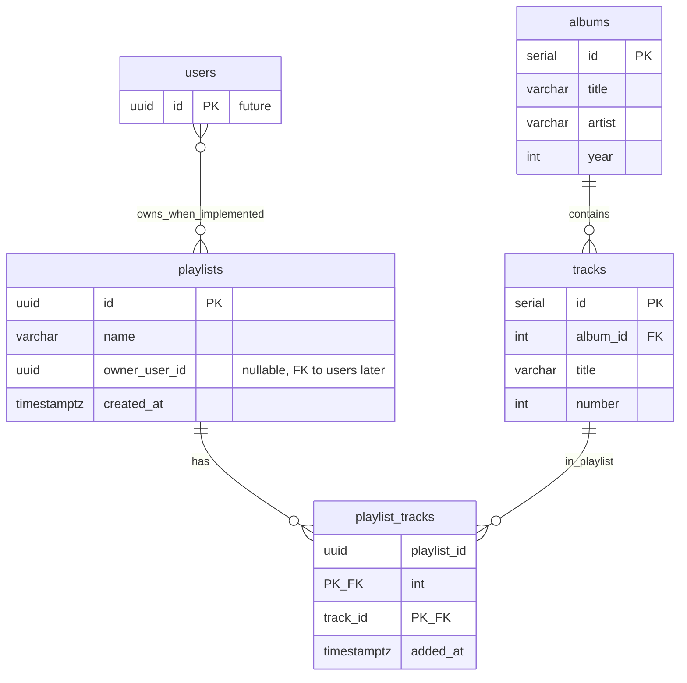

# Playlist Management — Technical Design Specification

**Music application · PostgreSQL & REST API extension**

| | |
|--|--|
| **Document owner** | Carter Wright |
| **Version** | 1.0 |
| **Last updated** | March 21, 2026 |
| **Context** | CST-391 Web Application Development · Instructor: James Sparks |

---

## Abstract

This specification describes the backend extension that adds **playlist management** to the existing music catalog: new PostgreSQL tables, referential relationships to catalog **tracks**, and REST endpoints exposed by the Next.js application on Vercel. It defines the data model, entity relationships, API contract, deployment expectations, and a path toward authenticated users and role-based access. The design keeps catalog data normalized, avoids duplicate track metadata in playlists, and uses a junction table for many-to-many membership.

---

## Table of contents

1. [Scope](#1-scope)
2. [Capabilities and requirements](#2-capabilities-and-requirements)
3. [Data model](#3-data-model)
4. [Entity-relationship documentation](#4-entity-relationship-documentation)
5. [Design rationale](#5-design-rationale)
6. [Identity, ownership, and access control](#6-identity-ownership-and-access-control)
7. [REST API](#7-rest-api)
8. [Implementation and operations](#8-implementation-and-operations)
9. [Verification](#9-verification)
10. [References](#10-references)

---

## 1. Scope

**In scope**

- PostgreSQL schema additions: `playlists`, `playlist_tracks`.
- REST API under `/api` for creating and listing playlists, managing track membership, and administrative list/delete operations.
- Documentation of intended access rules (customer vs administrator) and interim behavior where full authentication is not yet wired.

**Out of scope for this document’s implementation phase**

- End-user interface for playlists (handled in a separate front-end effort).
- Production user registration, session management, and middleware enforcement of roles (described as a forward-looking integration).

The existing **`albums`** and **`tracks`** tables remain the system of record for catalog content; this extension **adds** playlist structures that reference **`tracks.id`**.

---

## 2. Capabilities and requirements

**End users (customers)**

- Create named playlists and associate catalog tracks with them.
- Add and remove tracks within playlists they control (once ownership is enforced server-side).
- List their own playlists when filtered by owner identity.

**Administrators**

- View all playlists (moderation and support).
- Delete any playlist when required for policy or data hygiene.

**Implementation note**

- “Songs” in the API and schema correspond to rows in **`tracks`** (integer primary keys, tied to **`albums`**).

---

## 3. Data model

### 3.1 Source of truth

DDL for new objects:

**[playlists_schema.sql](../Milestone%20Guides/CST-391-Milestone4/playlists_schema.sql)**

Apply after **`albums`** and **`tracks`** exist. Runtime database: **PostgreSQL** (including managed Postgres on Vercel).

### 3.2 Table: `playlists`

| Column | Type | Constraints |
|--------|------|-------------|
| `id` | `UUID` | Primary key; default `gen_random_uuid()` |
| `name` | `VARCHAR(100)` | Not null |
| `owner_user_id` | `UUID` | Nullable; reserved for future FK to `users.id` |
| `created_at` | `TIMESTAMPTZ` | Not null; default `now()` |

**Index:** `idx_playlists_owner_user_id` on `(owner_user_id)`.

### 3.3 Table: `playlist_tracks` (junction)

| Column | Type | Constraints |
|--------|------|-------------|
| `playlist_id` | `UUID` | Not null; FK → `playlists(id)` **ON DELETE CASCADE** |
| `track_id` | `INTEGER` | Not null; FK → `tracks(id)` **ON DELETE CASCADE** |
| `added_at` | `TIMESTAMPTZ` | Not null; default `now()` |

**Primary key:** `(playlist_id, track_id)` — unique membership per playlist/track pair.

**Index:** `idx_playlist_tracks_track_id` on `(track_id)`.

**Extension:** `CREATE EXTENSION IF NOT EXISTS pgcrypto;` (UUID generation).

---

## 4. Entity-relationship documentation

**Relationships**

- **`albums`** → **`tracks`**: one-to-many (catalog).
- **`playlists`** ↔ **`playlist_tracks`** ↔ **`tracks`**: many-to-many; playlist membership references catalog tracks only by id.
- **`users`** (conceptual / future): one-to-many with **`playlists`** via `owner_user_id` once a `users` table and FK exist.

**Diagram (crow’s foot)** — full model: future **`users`**, **`playlists`**, **`playlist_tracks`**, **`albums`**, **`tracks`**. UUIDs identify users and playlists; integers identify albums and tracks, consistent with the shipped SQL script.

**Machine-readable summary (Mermaid)** — same topology for version control and tooling:

**Related assets**

- [updated-er-diagram.png](../Images/Diagrams/updated-er-diagram.png) — primary diagram (embedded above).
- [musicplayerUML.png](../Images/Diagrams/musicplayerUML.png), [musicplayerER.png](../Images/Diagrams/musicplayerER.png) — earlier conceptual diagrams (archive).

---

## 5. Design rationale

- **Normalization** — Track titles and album context remain in **`tracks`** / **`albums`**. The junction stores only ids and `added_at`, avoiding redundant catalog columns on each playlist row.
- **Many-to-many** — Standard junction pattern: a track may appear on many playlists; a playlist holds many tracks.
- **Uniqueness** — Composite primary key `(playlist_id, track_id)` prevents duplicate rows without application-only checks.
- **Referential integrity** — `ON DELETE CASCADE` on junction FKs removes membership when a playlist or catalog track is deleted, preventing orphaned links.
- **Performance** — Indexes support filtering playlists by owner and resolving “which playlists contain this track” when needed.

---

## 6. Identity, ownership, and access control

**Current state**

- `owner_user_id` is nullable so the service can run before a **`users`** table exists. Playlists without an owner support integration testing; playlists with a UUID support owner-scoped behavior using interim client-supplied identifiers (e.g. query parameter or header) until sessions exist.

**Target state**

- Introduce **`users`** (e.g. `id UUID PRIMARY KEY`) and add a **foreign key** from `playlists.owner_user_id` to `users.id`.
- Derive the acting user from the authenticated session; do not rely on client-supplied owner ids alone for authorization.
- **Customer** operations: create and mutate only playlists owned by the signed-in user.
- **Administrator** operations: global playlist visibility and delete; enforce **`admin`** role in middleware or route guards.

**Interim API behavior**

- Where ownership is set on a playlist, mutating routes may require a matching `X-Owner-User-Id` header as a bridge until JWT/session integration is complete. Listing without an owner filter may return all playlists in non-production or test configurations; production should narrow by identity once auth is live.

---

## 7. REST API

**Conventions**

- Base path: Next.js App Router, **`/api`**.
- JSON request and response bodies unless otherwise stated.
- Errors: typically `{ "error": "string" }`.

The **Authorization** column describes the **intended** production policy. Interim behavior may be more permissive during integration testing.

---

### `POST /api/playlists`

| | |
|--|--|
| **Summary** | Create a playlist. |
| **Authorization** | Authenticated end user. |
| **Body** | `{ "name": string }` — required, 1–100 characters. Optional: `"ownerUserId": string` (UUID) or `null`. |
| **Success** | `201 Created` — `id`, `name`, `ownerUserId`, `createdAt`, `trackCount` (e.g. `0`). |
| **Errors** | `400` validation; `500` server. |

---

### `GET /api/playlists`

| | |
|--|--|
| **Summary** | List playlists; optionally restrict by owner. |
| **Authorization** | End user sees own data when filtered; unauthenticated access is not assumed for production. |
| **Query** | Optional `ownerUserId` (UUID). When set, returns playlists for that owner. When omitted, behavior may return all rows in controlled environments; lock down in production. |
| **Success** | `200 OK` — array of `{ id, name, ownerUserId, createdAt, trackCount }`. |
| **Errors** | `400` invalid UUID; `500` server. |

---

### `POST /api/playlists/{id}/tracks`

| | |
|--|--|
| **Summary** | Add a catalog track to a playlist. `{id}` is playlist UUID. |
| **Authorization** | Playlist owner when `owner_user_id` is set. |
| **Headers** | `X-Owner-User-Id` must match owner when ownership applies (interim). |
| **Body** | `{ "trackId": number }` — `tracks.id`. |
| **Success** | `201 Created` — e.g. `{ playlistId, trackId }`. |
| **Errors** | `400`, `403`, `404`, `409` (duplicate membership), `500`. |

---

### `DELETE /api/playlists/{id}/tracks/{trackId}`

| | |
|--|--|
| **Summary** | Remove a track from a playlist. `trackId` is `tracks.id`. |
| **Authorization** | Owner when ownership applies. |
| **Headers** | `X-Owner-User-Id` when required (interim). |
| **Success** | `204 No Content`. |
| **Errors** | `400`, `403`, `404`, `500`. |

---

### `GET /api/admin/playlists`

| | |
|--|--|
| **Summary** | List all playlists (operations / moderation). |
| **Authorization** | Administrator. |
| **Success** | `200 OK` — same shape as unfiltered customer list. |
| **Errors** | `500`. |

---

### `DELETE /api/admin/playlists/{id}`

| | |
|--|--|
| **Summary** | Delete a playlist by UUID; junction rows cascade. |
| **Authorization** | Administrator. |
| **Success** | `204 No Content`. |
| **Errors** | `400`, `404`, `500`. |

---

## 8. Implementation and operations

- Run **[playlists_schema.sql](../Milestone%20Guides/CST-391-Milestone4/playlists_schema.sql)** on each PostgreSQL environment (local and hosted) after base catalog tables exist.
- API route handlers live under **`app/api/`** in the Next.js repository; deploy with the Vercel project.
- Configure **`POSTGRES_URL`** or **`DATABASE_URL`** for the database where migrations were applied.
- Follow REST norms: plural resource collections, appropriate status codes (`201` create, `204` delete with empty body, `4xx` for client issues).

---

## 9. Verification

Recommended validation before release:

- **Automated or manual API tests** — Exercise each endpoint (create playlist → add tracks → list → admin list → delete) against local and staged bases.
- **Postman collections** — Repository copies:  
  `cst391-music-app/postman/CST391-Music-API-Local.postman_collection.json`,  
  `cst391-music-app/postman/CST391-Music-API-Vercel.postman_collection.json`.
- **Recorded walkthrough** — Short demonstration of one handler’s structure and successful calls against the deployed API supports onboarding and audit trails.

---

## 10. References

- Grand Canyon University — CST-391 course materials and tutorials.
- Course milestone specification: [CST-391 Milestone 4 — Database and API Implementation](../Milestone%20Guides/CST-391-Milestone%204%20New%20Feature;%20Database%20and%20API%20Implementation.pdf).
- Prior planning artifact: [Project Proposal.md](Project%20Proposal.md).
- NIST — Role-based access control (general background).

---

*End of document.*
