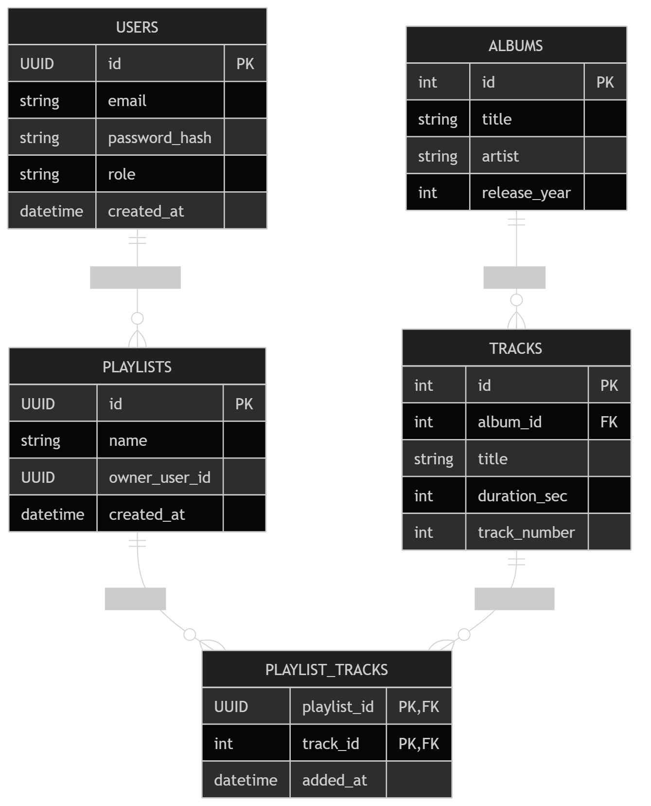
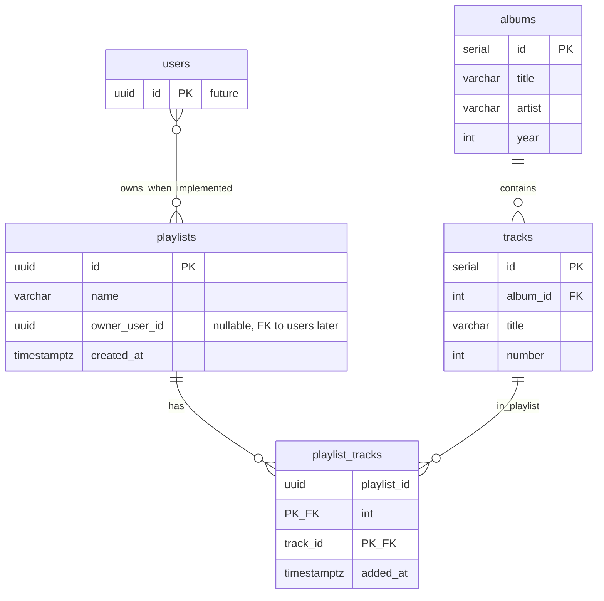
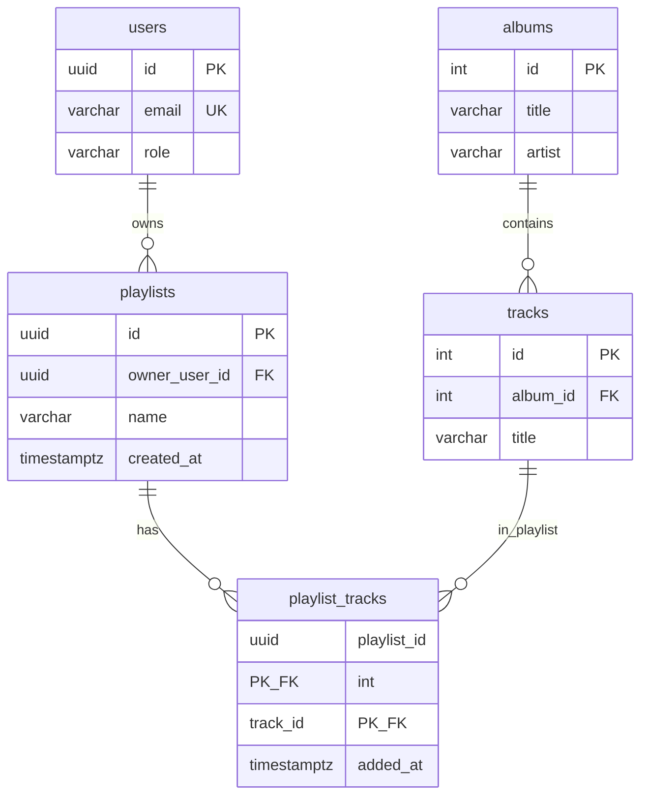
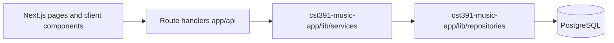

# Playlist Management — Technical Design Specification

**Music application · PostgreSQL & REST API extension**

| | |
|--|--|
| **Document owner** | Carter Wright |
| **Version** | 2.0 (Milestone 5) |
| **Last updated** | April 17, 2026 |
| **Context** | CST-391 Web Application Development · Instructor: James Sparks |

---

## Abstract

This specification describes the **playlist management** feature for the music catalog: PostgreSQL tables, relationships to catalog **tracks**, REST endpoints on the Next.js (Vercel) app, and—for **Milestone 5**—the **full UI**, **Auth.js (NextAuth) sessions with roles**, **RBAC on API routes**, and a **Clean Architecture** split (route handlers → services → repositories).

**How to read this document:** Sections **1–10** preserve the Milestone 4 database/API planning narrative. **Section 11** is the **authoritative Milestone 5** description (final implementation, user stories, API rules, UI flow, security, architecture, and reflection). **Section 12** maps the generic LMS Milestone 5 wording (React + Express + “product”) to this repository (Next.js + playlists). Where older sections mention “interim” headers or future auth, **Section 11** reflects what is actually shipped.

The design keeps catalog data normalized, avoids duplicate track metadata in playlists, and uses a junction table for many-to-many membership.

---

## Table of contents

1. [Scope](#1-scope)
2. [Capabilities and requirements](#2-capabilities-and-requirements)
3. [Data model](#3-data-model)
4. [Entity-relationship documentation](#4-entity-relationship-documentation)
5. [Design rationale](#5-design-rationale)
6. [Identity, ownership, and access control](#6-identity-ownership-and-access-control)
7. [REST API](#7-rest-api)
8. [Implementation and operations](#8-implementation-and-operations)
9. [Verification](#9-verification)
10. [References](#10-references)
11. [Milestone 5 — Final implementation](#11-milestone-5--final-implementation-ui-rbac-clean-architecture)
12. [LMS Milestone 5 — Design alignment](#12-lms-milestone-5--design-alignment-course-instructions)

---

## 1. Scope

**In scope**

- PostgreSQL schema additions: `playlists`, `playlist_tracks`.
- REST API under `/api` for creating and listing playlists, managing track membership, and administrative list/delete operations.
- Documentation of intended access rules (customer vs administrator) and interim behavior where full authentication is not yet wired.

**Out of scope for this document’s implementation phase**

- End-user interface for playlists (handled in a separate front-end effort).
- Production user registration, session management, and middleware enforcement of roles (described as a forward-looking integration).

The existing **`albums`** and **`tracks`** tables remain the system of record for catalog content; this extension **adds** playlist structures that reference **`tracks.id`**.

---

## 2. Capabilities and requirements

**End users (customers)**

- Create named playlists and associate catalog tracks with them.
- Add and remove tracks within playlists they control (once ownership is enforced server-side).
- List their own playlists when filtered by owner identity.

**Administrators**

- View all playlists (moderation and support).
- Delete any playlist when required for policy or data hygiene.

**Implementation note**

- “Songs” in the API and schema correspond to rows in **`tracks`** (integer primary keys, tied to **`albums`**).

---

## 3. Data model

### 3.1 Source of truth

DDL for new objects:

**[playlists_schema.sql](../Milestone%20Guides/CST-391-Milestone4/playlists_schema.sql)**

Apply after **`albums`** and **`tracks`** exist. Runtime database: **PostgreSQL** (including managed Postgres on Vercel).

### 3.2 Table: `playlists`

| Column | Type | Constraints |
|--------|------|-------------|
| `id` | `UUID` | Primary key; default `gen_random_uuid()` |
| `name` | `VARCHAR(100)` | Not null |
| `owner_user_id` | `UUID` | Nullable; reserved for future FK to `users.id` |
| `created_at` | `TIMESTAMPTZ` | Not null; default `now()` |

**Index:** `idx_playlists_owner_user_id` on `(owner_user_id)`.

### 3.3 Table: `playlist_tracks` (junction)

| Column | Type | Constraints |
|--------|------|-------------|
| `playlist_id` | `UUID` | Not null; FK → `playlists(id)` **ON DELETE CASCADE** |
| `track_id` | `INTEGER` | Not null; FK → `tracks(id)` **ON DELETE CASCADE** |
| `added_at` | `TIMESTAMPTZ` | Not null; default `now()` |

**Primary key:** `(playlist_id, track_id)` — unique membership per playlist/track pair.

**Index:** `idx_playlist_tracks_track_id` on `(track_id)`.

**Extension:** `CREATE EXTENSION IF NOT EXISTS pgcrypto;` (UUID generation).

---

## 4. Entity-relationship documentation

**Relationships**

- **`albums`** → **`tracks`**: one-to-many (catalog).
- **`playlists`** ↔ **`playlist_tracks`** ↔ **`tracks`**: many-to-many; playlist membership references catalog tracks only by id.
- **`users`** (conceptual / future): one-to-many with **`playlists`** via `owner_user_id` once a `users` table and FK exist.

**Diagram (crow’s foot)** — full model: future **`users`**, **`playlists`**, **`playlist_tracks`**, **`albums`**, **`tracks`**. UUIDs identify users and playlists; integers identify albums and tracks, consistent with the shipped SQL script.

**Machine-readable summary (Mermaid)** — same topology for version control and tooling:

**Related assets**

- [updated-er-diagram.png](../Images/Diagrams/updated-er-diagram.png) — primary diagram (embedded above).
- [musicplayerUML.png](../Images/Diagrams/musicplayerUML.png), [musicplayerER.png](../Images/Diagrams/musicplayerER.png) — earlier conceptual diagrams (archive).

---

## 5. Design rationale

- **Normalization** — Track titles and album context remain in **`tracks`** / **`albums`**. The junction stores only ids and `added_at`, avoiding redundant catalog columns on each playlist row.
- **Many-to-many** — Standard junction pattern: a track may appear on many playlists; a playlist holds many tracks.
- **Uniqueness** — Composite primary key `(playlist_id, track_id)` prevents duplicate rows without application-only checks.
- **Referential integrity** — `ON DELETE CASCADE` on junction FKs removes membership when a playlist or catalog track is deleted, preventing orphaned links.
- **Performance** — Indexes support filtering playlists by owner and resolving “which playlists contain this track” when needed.

---

## 6. Identity, ownership, and access control

**Current state**

- `owner_user_id` is nullable so the service can run before a **`users`** table exists. Playlists without an owner support integration testing; playlists with a UUID support owner-scoped behavior using interim client-supplied identifiers (e.g. query parameter or header) until sessions exist.

**Target state**

- Introduce **`users`** (e.g. `id UUID PRIMARY KEY`) and add a **foreign key** from `playlists.owner_user_id` to `users.id`.
- Derive the acting user from the authenticated session; do not rely on client-supplied owner ids alone for authorization.
- **Customer** operations: create and mutate only playlists owned by the signed-in user.
- **Administrator** operations: global playlist visibility and delete; enforce **`admin`** role in middleware or route guards.

**Interim API behavior**

- Where ownership is set on a playlist, mutating routes may require a matching `X-Owner-User-Id` header as a bridge until JWT/session integration is complete. Listing without an owner filter may return all playlists in non-production or test configurations; production should narrow by identity once auth is live.

---

## 7. REST API

**Conventions**

- Base path: Next.js App Router, **`/api`**.
- JSON request and response bodies unless otherwise stated.
- Errors: typically `{ "error": "string" }`.

The **Authorization** column describes the **intended** production policy. Interim behavior may be more permissive during integration testing.

---

### `POST /api/playlists`

| | |
|--|--|
| **Summary** | Create a playlist. |
| **Authorization** | Authenticated end user. |
| **Body** | `{ "name": string }` — required, 1–100 characters. Optional: `"ownerUserId": string` (UUID) or `null`. |
| **Success** | `201 Created` — `id`, `name`, `ownerUserId`, `createdAt`, `trackCount` (e.g. `0`). |
| **Errors** | `400` validation; `500` server. |

---

### `GET /api/playlists`

| | |
|--|--|
| **Summary** | List playlists; optionally restrict by owner. |
| **Authorization** | End user sees own data when filtered; unauthenticated access is not assumed for production. |
| **Query** | Optional `ownerUserId` (UUID). When set, returns playlists for that owner. When omitted, behavior may return all rows in controlled environments; lock down in production. |
| **Success** | `200 OK` — array of `{ id, name, ownerUserId, createdAt, trackCount }`. |
| **Errors** | `400` invalid UUID; `500` server. |

---

### `POST /api/playlists/{id}/tracks`

| | |
|--|--|
| **Summary** | Add a catalog track to a playlist. `{id}` is playlist UUID. |
| **Authorization** | Playlist owner when `owner_user_id` is set. |
| **Headers** | `X-Owner-User-Id` must match owner when ownership applies (interim). |
| **Body** | `{ "trackId": number }` — `tracks.id`. |
| **Success** | `201 Created` — e.g. `{ playlistId, trackId }`. |
| **Errors** | `400`, `403`, `404`, `409` (duplicate membership), `500`. |

---

### `DELETE /api/playlists/{id}/tracks/{trackId}`

| | |
|--|--|
| **Summary** | Remove a track from a playlist. `trackId` is `tracks.id`. |
| **Authorization** | Owner when ownership applies. |
| **Headers** | `X-Owner-User-Id` when required (interim). |
| **Success** | `204 No Content`. |
| **Errors** | `400`, `403`, `404`, `500`. |

---

### `GET /api/admin/playlists`

| | |
|--|--|
| **Summary** | List all playlists (operations / moderation). |
| **Authorization** | Administrator. |
| **Success** | `200 OK` — same shape as unfiltered customer list. |
| **Errors** | `500`. |

---

### `DELETE /api/admin/playlists/{id}`

| | |
|--|--|
| **Summary** | Delete a playlist by UUID; junction rows cascade. |
| **Authorization** | Administrator. |
| **Success** | `204 No Content`. |
| **Errors** | `400`, `404`, `500`. |

---

## 8. Implementation and operations

- Run **[playlists_schema.sql](../Milestone%20Guides/CST-391-Milestone4/playlists_schema.sql)** on each PostgreSQL environment (local and hosted) after base catalog tables exist.
- API route handlers live under **`app/api/`** in the Next.js repository; deploy with the Vercel project.
- Configure **`POSTGRES_URL`** or **`DATABASE_URL`** for the database where migrations were applied.
- Follow REST norms: plural resource collections, appropriate status codes (`201` create, `204` delete with empty body, `4xx` for client issues).

---

## 9. Verification

Recommended validation before release:

- **Automated or manual API tests** — Exercise each endpoint (create playlist → add tracks → list → admin list → delete) against local and staged bases.
- **Postman collections** — Repository copies:  
  `cst391-music-app/postman/CST391-Music-API-Local.postman_collection.json`,  
  `cst391-music-app/postman/CST391-Music-API-Vercel.postman_collection.json`.
- **Recorded walkthrough** — Short demonstration of one handler’s structure and successful calls against the deployed API supports onboarding and audit trails.

---

## 10. References

- Grand Canyon University — CST-391 course materials and tutorials.
- Course milestone specification: [CST-391 Milestone 4 — Database and API Implementation](../Milestone%20Guides/CST-391-Milestone%204%20New%20Feature;%20Database%20and%20API%20Implementation.pdf).
- Course milestone specification: [CST-391 Milestone 5 — New Feature Implementation](../Milestone%20Guides/CST-391-Milestone%205%20New%20Feature%20Implementation.pdf).
- Prior planning artifact: [Project Proposal.md](Project%20Proposal.md).
- NIST — Role-based access control (general background).

---

## 11. Milestone 5 — Final implementation (UI, RBAC, Clean Architecture)

### 11.1 Feature summary

Playlist management is fully implemented in the Next.js UI with **GitHub OAuth** and **credentials (email/password)** via Auth.js / NextAuth, **role-based access** for guests, signed-in users, and administrators, and a **Clean Architecture** split: playlist API route handlers delegate to **services** under `cst391-music-app/lib/services/` and **repositories** under `cst391-music-app/lib/repositories/` (the course handout refers to `src/lib/...`; this app uses the common Next.js layout **`lib/` at the project root** without a `src/` folder—same layering). Users create playlists, add/remove catalog tracks (by local `trackId` or by importing from TheAudioDB via `audioDbTrackId` / `recordingMbid`), and list their playlists; admins list all playlists and may delete any playlist for moderation.

### 11.2 Revised user stories

| Actor | Story |
|--------|--------|
| **Guest** | As a guest, I can use **Home** and **Discover**, open **Library** in the sidebar, and see a **sign-in prompt** instead of my playlists; the home hero also invites me to sign in to unlock playlists. I cannot create or edit playlists until I authenticate. |
| **User** | As a signed-in user, I can create playlists, see **only my** playlists on **Library** (`/library`, alias `/playlists`), open a playlist detail page to view tracks with album/artist context, add tracks from album flows, and rename or delete playlists I own. |
| **User (edge)** | As a signed-in user, if I try to open another user’s playlist URL, the API returns **403** and the UI shows an error (I cannot view or mutate it). |
| **Admin** | As an admin, I see **Admin** in the sidebar, open **`/admin`**, use the **Playlists** tab to load **all** playlists (with owner ids and track counts), and delete any playlist via the admin API; middleware blocks non-admins from `/admin/**`. |

### 11.3 Data model updates

- **`users`** — `id` (UUID), `email` (unique), `name`, `image`, `role` (`user` \| `admin`), `password_hash` (credentials users), `created_at`. DDL: [`users_schema.sql`](../Milestone%20Guides/CST-391-Milestone5/users_schema.sql) (verify against repo).
- **`playlists.owner_user_id`** — Set from the authenticated user on create; FK to `users.id` when migrations are applied.
- Existing **`playlists`**, **`playlist_tracks`**, **`albums`**, **`tracks`** relationships are unchanged; static ER asset: [`updated-er-diagram.png`](../Images/Diagrams/updated-er-diagram.png).

#### 11.3.1 Final ER (Milestone 5, text)

### 11.4 REST API (final) and role rules

| Method | Path | Rule |
|--------|------|------|
| `GET` | `/api/playlists` | **Authenticated** — **401** if no session; returns **only** the caller’s playlists. |
| `POST` | `/api/playlists` | **Authenticated** — body `{ "name" }`; `owner_user_id` comes **only** from the session. |
| `GET` | `/api/playlists/[id]` | **Authenticated** — **403** if not owner and not admin; **404** if missing. Returns playlist + tracks. |
| `PATCH` | `/api/playlists/[id]` | **Authenticated** — body `{ "name" }`; owner or **admin** may rename; **403** / **404** as applicable. |
| `DELETE` | `/api/playlists/[id]` | **Authenticated** — owner or **admin** may delete; **403** / **404** as applicable. |
| `POST` | `/api/playlists/[id]/tracks` | **Authenticated** — body one of: `{ "trackId": number }`, `{ "audioDbTrackId": string }`, or `{ "recordingMbid": string }` (last two import/upsert via TheAudioDB then add); owner or **admin**; **404** / **409** (duplicate) / **502** (import failure) as applicable. |
| `DELETE` | `/api/playlists/[id]/tracks/[trackId]` | Same ownership rules as add. |
| `GET` | `/api/admin/playlists` | **Admin** only — **401** if unauthenticated; **403** if not admin. |
| `DELETE` | `/api/admin/playlists/[id]` | **Admin** only — **204** on success. |

Unauthenticated requests to protected routes return **401**; forbidden role or ownership returns **403**; missing resources return **404**.

### 11.5 UI / UX flow

- **Navigation (left rail)** — **Home**, **Search** (opens universal search or home search), **Discover**, **Library** (`/library`); **Admin** → **`/admin`** **only when** `session.user.role === "admin"`; hero **SIGN IN** / **REGISTER** / **LOG OUT** on Home.
- **`/library`** (same UI as **`/playlists`**) — Guests: copy + **Sign in** button (`callbackUrl=/library`). Users: grid of owned playlists, create, rename (edit route), delete; cards link to **`/library/[id]`** (detail).
- **`/library/create`** and **`/playlists/create`** — Middleware requires sign-in; create flow then continues in-app.
- **`/library/[id]`** / **`/playlists/[id]`** — Middleware requires sign-in; track list, remove track, add from catalog flows; **403** surfaced as error state where applicable.
- **`/admin`** — Unified admin dashboard (users, playlists, albums, tracks); playlist moderation uses the **Playlists** tab and the same admin playlist APIs; non-admins are redirected by middleware.

### 11.6 Security and RBAC

- **Middleware** — Requires authentication for **`/library/**`** (except `/library` list), **`/playlists/**`** (except `/playlists` list), and **`/admin/**`**; **admin** role required for `/admin/**`. Guests may hit **`/`**, **`/discover`**, **`/library`** (list), **`/playlists`** (list), and auth pages.
- **UI** — Admin link is **hidden** unless `role === "admin"`; hidden UI is **not** a security boundary—APIs still return **401/403**.
- **Session** — JWT carries `user.id` and `user.role`; ownership uses `users.id` = `playlists.owner_user_id`.
- **Admin promotion** — `ADMIN_EMAILS` (comma-separated) promotes matching GitHub emails to `admin` on sign-in (see auth wiring in codebase).

### 11.7 Architecture (UI → API → services → repositories)

**Playlist feature:** `playlist-service.ts` orchestrates rules; `playlist-repository.ts` owns SQL for `playlists` / `playlist_tracks`. **Other domains** (e.g. some music search/album routes) may still use `getPool()` in route handlers; the Milestone 5 playlist vertical is fully layered as required.

### 11.8 Clean Architecture reflection

Route files act as **HTTP adapters**: validate shape (e.g. UUID), parse JSON, call `playlist-service` with the Auth.js session, map `ServiceResult` to status codes. **Repositories** concentrate SQL for playlists and `playlist_tracks` (list, insert, joins, deletes). **Services** enforce authorization (owner vs admin), validation, and orchestration (e.g. transaction boundary when adding a track). That keeps rules **testable** and avoids trusting the browser for permissions—the UI hides controls, but the API **always** decides.

### 11.9 Assumptions, constraints, and AI usage

- **Assumptions** — GitHub OAuth credentials and `AUTH_SECRET` are configured in each environment; `users` table migration has been applied where playlist ownership is enforced.
- **Constraints** — Playlist sharing and public playlist URLs are out of scope.
- **AI usage** — Cursor / GPT-assisted implementation and refactoring for Milestone 5 (auth wiring, repository/service extraction, UI pages, and this documentation update).

---

## 12. LMS Milestone 5 — Design alignment (course instructions)

The official Milestone 5 brief describes a **React** client integrated with **Express** APIs and a generic **“product”** resource. This project’s **delivered software** uses **Next.js (React) App Router** with **Next.js route handlers** instead of a separate Express server, and the CRUD resource is the **playlist** (plus **playlist track membership**), not a separate `products` table. Aside from that stack mapping, the implementation satisfies the same intent: **list, create, read, update, and delete** the resource from the UI with navigation.

### 12.1 Design vs. delivery (summary table)

| Topic | Design / instruction | Delivered software | Notes |
|--------|----------------------|--------------------|--------|
| **Client** | React SPA | **Next.js** (React 19) with server and client components | Framework per course project evolution. |
| **API host** | Express / Node | **Next.js `app/api/*` route handlers** | REST JSON APIs; no separate Express process. |
| **“Product” CRUD** | Product entity | **Playlist** CRUD (`/api/playlists`, `/api/playlists/[id]`) | Rename = **update**; tracks managed via nested routes. |
| **Navigation** | App navigation + **Bootstrap NavBar** | **Left rail** (`LeftSidebar`) with Bootstrap **`list-unstyled`** + custom **`wf-sidebar-link`** styles; **no top `NavBar`** in the current shell | *Gap for LMS screencast:* assignment explicitly asks for a **Bootstrap NavBar**—restore a thin top `navbar` (see `bootstrap-client.tsx`) or confirm with the instructor. |
| **REST documentation** | Postman (or similar) | **Section 11.4** + existing Postman collections if present in repo; otherwise export a collection from Postman pointing at the same paths | Attach exported JSON or published Postman documentation to the submission. |
| **Screencast / PowerPoint** | Required | *Student deliverables* | Record UI navigation, CRUD, and slide deck per LMS (challenges, open issues, lessons learned). |

### 12.2 Known issues / intentional differences

- **Bootstrap NavBar (LMS)** — The generic Milestone 5 handout expects a visible **Bootstrap NavBar**. This build uses **sidebar navigation** only; for full alignment with that rubric item, add a **top** `navbar navbar-expand-lg` (can coexist with the sidebar).
- **Non-playlist APIs** — Some catalog endpoints (`/api/music/*`, `/api/albums`, etc.) are not fully refactored into repository/service layers; the **playlist** vertical is layered (see §11.7).
- **Next.js middleware warning** — The framework may warn that the `middleware` convention is deprecated in favor of `proxy`; non-blocking for this milestone.

---

*End of document.*
